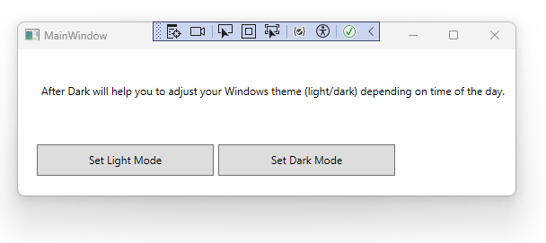

AfterDark (AfterDarkness)
=========================

This software is to change your system theme from light to dark using two buttons.

Current features:
- Buttons for changing light/dark mode

Planned features:
- Timer: Set dark / light mode depending on time of the day
- Tray icon: Show/hide program in tray

Screenshot:
